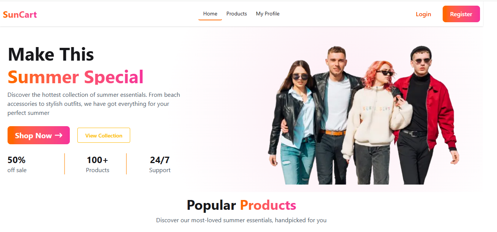

<div align="center">


</div>

---

<div align="center">

[](https://suncart-blue.vercel.app)
[](https://nextjs.org)
[](https://tailwindcss.com)

</div>

---

## 📌 Overview

**SunCart** is a modern summer eCommerce platform where users can browse seasonal products like sunglasses, skincare, beach accessories, and summer outfits. Users can explore product details and place orders after authentication — all wrapped in a clean, fully responsive UI.

---

## 📸 Screenshot



---

## ✨ Core Features

- 🛍️ Browse a curated collection of summer products
- 🔍 Detailed product pages with full product info
- 🔐 Authentication — Login, Register, and Google Sign-in
- 👤 User profile with update functionality
- 📱 Fully responsive across mobile, tablet, and desktop

---

## 🛠️ Tech Stack

| Layer | Technology |
|---|---|
| Framework | Next.js |
| UI Library | React |
| Styling | Tailwind CSS + DaisyUI |
| Authentication | BetterAuth |
| Forms | React Hook Form |
| Notifications | Sonner |
| Icons | React Icons |
| Hosting | Vercel |

---

## 📦 Dependencies

```json
{
  "next": "latest",
  "react": "latest",
  "react-hook-form": "latest",
  "sonner": "latest",
  "react-icons": "latest",
  "better-auth": "latest",
  "tailwindcss": "latest",
  "daisyui": "latest"
}
```

> See full versions in `package.json`

---

## 🖥️ Run Locally

**1. Clone the repository**
```bash
git clone https://github.com/officialshahidulshihab/suncart.git
```

**2. Navigate into the folder**
```bash
cd suncart
```

**3. Install dependencies**
```bash
npm install
```

**4. Set up environment variables**

Create a `.env.local` file in the root and add:
```env
BETTER_AUTH_SECRET=your_secret_here
BETTER_AUTH_URL=http://localhost:3000
MONGODB_URI=your_mongodb_connection_string
GOOGLE_CLIENT_ID=your_google_client_id
GOOGLE_CLIENT_SECRET=your_google_client_secret
```

**5. Run the development server**
```bash
npm run dev
```

**6. Open in browser**
```
http://localhost:3000
```

---

## 🔗 Resources

- 🌐 [Live Site](https://suncart-blue.vercel.app)
- 💼 [My GitHub](https://github.com/officialshahidulshihab)
- 📧 [Contact](mailto:officialshahidulshihab@gmail.com)

---

<div align="center">


Made with ❤️ by [MD Shahidul Islam Shihab](https://github.com/officialshahidulshihab)

</div>